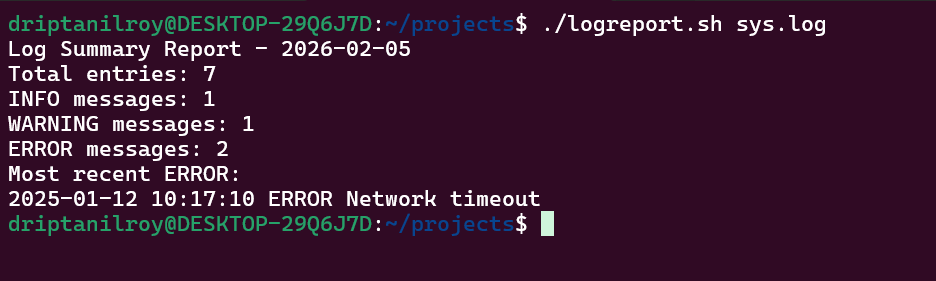

1. The script must accept the log file name as a command-line argument.

2. Validate that the file exists and is readable.

3. Count and display:

  - Total number of log entries

  - Number of INFO, WARNING, and ERROR messages

4. Display the most recent ERROR message.

5. Generate a report file named logsummary_<date>.txt.

6. Handle errors gracefully with meaningful messages.

All of them are visible here:

